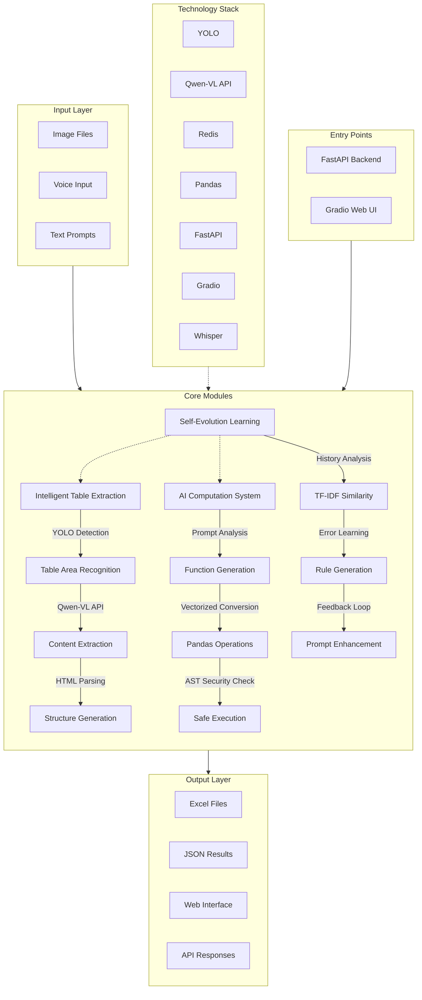

# Table AI - Intelligent Table Processing System

Table AI is a powerful intelligent table processing system that provides two core functions: table data extraction from images and AI computation, supporting both FastAPI backend service and Gradio Web interface usage modes.

## 📐 Architecture Diagram



## 🌟 Highlight: Self-Evolution Learning System

Table AI features a unique self-evolution capability implemented in `src/modules/qwen_learning.py`, enabling the system to continuously improve its performance through historical data analysis and feedback loops.

### Core Self-Evolution Features

- **Learning from History**: Analyzes successful cases using TF-IDF similarity to generate better prompts for similar tasks
- **Error-Driven Learning**: Identifies and remembers common errors, creating preventive rules to avoid repeated mistakes
- **Feedback Integration**: Incorporates user feedback to refine and improve future performance
- **Persistent Knowledge**: Stores learning data in Redis for distributed knowledge sharing
- **Real-time Improvement**: Continuously updates its models during operation

### Key Technical Implementation

- **TF-IDF Vectorization**: Uses character-wise n-gram TF-IDF with stop-word filtering to find similar historical cases
- **Similarity Matching**: Computes cosine similarity between current tasks and historical data to retrieve relevant experiences
- **Rule Generation**: Creates hard-coded preventive rules based on common error patterns
- **Prompt Enhancement**: Automatically adds error warnings and success tips to improve prompt quality
- **Multi-modal Learning**: Learns from both successful and failed attempts to create a balanced knowledge base

### Self-Evolution Workflow

1. **Task Execution**: System processes user requests
2. **Result Evaluation**: Success/failure status is recorded
3. **Knowledge Storage**: Data is saved to Redis for future reference
4. **Pattern Analysis**: System analyzes historical data for patterns and trends
5. **Model Update**: TF-IDF vectorizer is updated with new data
6. **Enhanced Performance**: Improved prompts and rules are applied to future tasks

This self-evolution capability sets Table AI apart from traditional OCR systems, allowing it to adapt and improve over time with minimal human intervention.

## 📁 Project Structure

The core code of the project is located in the `src/` directory, containing functional modules and utility functions:

```
table-ai/
├── src/                  # Core source code directory
│   ├── modules/          # Functional modules
│   │   ├── ai_service.py            # AI service management
│   │   ├── api_manager.py           # API request management
│   │   ├── multi_column_processor.py # Multi-column table processing
│   │   ├── prompt_generator.py      # AI prompt generation
│   │   ├── qwen_vl_manager.py       # Qwen-VL API client
│   │   ├── table_processor.py       # Core table extraction processing
│   │   ├── vectorized_function_converter.py # Vectorized function conversion (AI computation)
│   │   ├── voice_service.py         # Speech recognition service
│   ├── utils/            # Utility functions
│   │   ├── ast_security_checker.py  # AST code security checking
│   │   ├── async_task_manager.py    # Asynchronous task management
│   │   ├── config.py                # Configuration management
│   │   ├── dual_redis_db.py         # Redis database management
│   │   ├── logger.py                # Log management
│   ├── scrips/ 
│   |   ├── redis_integrated_main.py     # Redis integrated main program
│   |   ├── table.yaml                   # Table configuration
|   ├──weight/
|   |   ├──readme.md                       #best.pt
├── main.py               # FastAPI backend service entry
├── gradio_app.py         # Gradio Web interface entry
├── config.json           # Configuration file
├── requirements.txt      # Dependency list
└── README.md             # Project description
```

## 🔗 Two Main Entry Points

### 1. FastAPI Backend Service (`main.py`)
- **Function**: Provides RESTful API interfaces, supporting file upload, task management and status query
- **Use Case**: Suitable for integration into other systems, automation scripts, or as a microservice
- **Main Endpoints**:
  - `POST /api/upload`: Batch upload files and add to task queue
  - `GET /api/task/{task_id}`: Get specific task status
- **Technology Stack**: FastAPI + Uvicorn + Redis

### 2. Gradio Web Interface (`gradio_app.py`)
- **Function**: Provides visual interactive interface, suitable for direct use
- **Use Case**: No programming required, suitable for ordinary users to use quickly
- **Main Features**:
  - Image upload and preview
  - Voice input support
  - Real-time progress display
  - Result preview and download
  - Batch processing support
  - Automatic ZIP packaging of results
- **Technology Stack**: Gradio + Python

## 🚀 Two Core Functions

### 1. Intelligent Table Extraction System

**Function Description**: Extract table data from various image formats, supporting complex layouts and multi-column tables

**Implementation Modules**: `src/modules/table_processor.py`, `src/modules/qwen_vl_manager.py`, `src/modules/multi_column_processor.py`

**Technology Stack**:
- **Object Detection**: YOLO model (table area detection)
- **AI Recognition**: Qwen-VL API (table content extraction)
- **Image Processing**: OpenCV (image enhancement, size optimization)
- **HTML Parsing**: lxml (fast table structure parsing)
- **Result Generation**: openpyxl (Excel file generation)

**Processing Flow**:
1. **Image Preprocessing**:
   - Use YOLO model to crop the core table area (remove page numbers and white borders)
   - Image enhancement: contrast enhancement to make borders more obvious
   - Image optimization: automatically adjust size (max 1536px) to improve AI inference speed
   - Confidence evaluation: record low-confidence cases for model optimization

2. **Table Extraction**:
   - Call Qwen-VL API for table recognition
   - Generate HTML format table structure
   - Support complex table layouts
   - Support multi-column table processing

3. **Result Processing**:
   - HTML to Excel: fast processing using lxml parser
   - Dynamic row height adjustment
   - Border style settings
   - Cell content alignment

**Core Features**:
- Support for multiple image formats
- Process complex table layouts
- Support for multi-column tables
- High-precision recognition
- Batch processing support
- Automatic ZIP packaging of results

### 2. AI Computation System

**Function Description**: Use AI for data processing and computation, supporting multiple Excel function conversions and vectorized operations

**Implementation Modules**: `src/modules/vectorized_function_converter.py`, `src/modules/ai_service.py`

**Technology Stack**:
- **Data Processing**: pandas (vectorized operation optimization)
- **AI Service**: Qwen API (intelligent computation AI model)
- **Function Conversion**: Custom algorithm (Excel function to pandas operation conversion)

**Supported Function Types**:
- **Text Processing**: LOWER, UPPER, TRIM, SUBSTITUTE, LEN, LEFT, RIGHT, MID, FIND
- **Numeric Processing**: ROUND, INT, ABS
- **Date Processing**: TEXT
- **Conditional Processing**: IF
- **Concatenation Functions**: CONCATENATE, &

**Processing Flow**:
1. Parse AI-generated functions
2. Convert to pandas vectorized operations
3. Execute optimized operations
4. Return processing results

**Core Features**:
- High performance: vectorized operations, 10-100 times faster than loops
- Support for multiple Excel functions
- Automatic optimization: intelligently selects optimal processing method
- Safe and reliable: AST code security checking
- Easy to extend: supports custom functions

## 🛠️ Auxiliary Functions

### 1. Voice Input Support (`src/modules/voice_service.py`)
- **Function**: Control the application through voice, supporting Chinese voice commands
- **Technology**: Whisper model (local) + Qwen API (cloud backup)
- **Support**: Chinese voice commands, reliable degradation mechanism

### 2. High Performance Processing (`src/redis_integrated_main.py`)
- **Function**: Fast processing of large numbers of images, improving system throughput
- **Technology**: 8-thread parallel processing + Redis distributed queue
- **Optimization**: Image size limitation, lxml parser, API parameter optimization

### 3. Code Security Check (`src/utils/ast_security_checker.py`)
- **Function**: Detect potential security issues in Python code
- **Technology**: AST syntax tree analysis
- **Support**: Dangerous function detection, risk level assessment

### 4. Flexible Configuration Management (`src/utils/config.py`)
- **Function**: Dynamically adjust application parameters, supporting multiple configuration methods
- **Technology**: Environment variables + configuration files
- **Priority**: Environment variables > Configuration files > Default values

## 🛠️ Detailed Technology Stack

### Core Framework
| Category | Technology | Version | Purpose |
|----------|------------|---------|---------|
| Web Framework | FastAPI | - | Backend RESTful API service |
| Visualization Framework | Gradio | - | Web interface interaction |

### Document Processing
| Technology | Version | Purpose |
|------------|---------|---------|
| openpyxl | >=3.1.2 | Excel file creation and modification |
| pandas | >=1.5.3 | Data analysis and processing (core of AI computation) |
| python-docx | >=0.8.11 | Word document processing |
| python-pptx | >=0.6.21 | PowerPoint processing |

### Image Processing (Core of Table Extraction)
| Technology | Version | Purpose |
|------------|---------|---------|
| Pillow | >=10.0.1 | Basic image processing library |
| pytesseract | >=0.3.10 | OCR text recognition |
| opencv-python | >=4.8.1.78 | Computer vision processing |
| ultralytics | - | YOLO model integration |
| paddlepaddle | >=3.2.2 | Deep learning framework |
| paddleocr | >=3.3.2 | High-precision OCR recognition |

### AI Services (Shared by Two Core Functions)
| Technology | Version | Purpose |
|------------|---------|---------|
| Qwen-VL API | - | Table extraction AI model |
| Qwen API | - | Intelligent computation AI model |
| Whisper | - | Local speech recognition model |

### Network and Data
| Technology | Version | Purpose |
|------------|---------|---------|
| requests | >=2.31.0 | HTTP request processing |
| beautifulsoup4 | >=4.12.2 | HTML parsing |
| lxml | >=4.9.3 | High-performance XML/HTML parsing |
| redis | - | Distributed queue and caching |

### Text Processing
| Technology | Version | Purpose |
|------------|---------|---------|
| nltk | >=3.8.1 | Natural language processing |
| jieba | >=0.42.1 | Chinese word segmentation |
| markdown | >=3.4.4 | Markdown processing |
| pyyaml | >=6.0.1 | YAML configuration processing |

### Data Visualization
| Technology | Version | Purpose |
|------------|---------|---------|
| matplotlib | >=3.7.5 | Data visualization |
| seaborn | >=0.12.2 | Statistical data visualization |
| numpy | >=1.24.3 | Numerical computation |

## 📋 System Requirements

- **Operating System**: Windows 10/11, Linux
- **Python Version**: Python 3.10+
- **Memory**: 8GB or more recommended
- **Storage**: 500MB available space
- **Optional**: Redis server (for distributed processing)

## 🛠️ Installation and Deployment

### 1. Clone the Project
```bash
git clone https://github.com/jinzhao-rjb/table-ai.git
cd table-ai
```

### 2. Install Dependencies
```bash
pip install -r requirements.txt
```

### 3. Configure Environment

#### Environment Variable Configuration
```env
# AI API Configuration
AI_API_KEY=your_api_key_here
AI_MODEL=qwen-vl-plus
AI_API_TYPE=qwen

# Redis Configuration (Optional)
REDIS_HOST=localhost
REDIS_PORT=6379
REDIS_DB=0
```

#### Configuration File
Edit the `config.json` file, set related parameters:
```json
{
  "ai_api_key": "your_api_key",
  "ai_model": "qwen-vl-plus",
  "max_threads": 8,
  "max_image_size": 1536,
  "max_tokens": 2000
}
```

## 🚀 Quick Start

### Method 1: Start FastAPI Backend Service
```bash
python main.py
```
The service will run at `http://localhost:8000`

### Method 2: Start Gradio Web Interface
```bash
python gradio_app.py
```
The interface will run at `http://localhost:7860`

## 📊 Performance Optimization

### Optimization Measures
1. **Image Size Limitation**: Max 1536px, reduce AI inference time
2. **Multi-thread Processing**: 8-thread parallel, improve processing speed
3. **lxml Parser**: Faster HTML parsing than BeautifulSoup
4. **API Parameter Optimization**: max_tokens=2000, balance speed and accuracy
5. **Redis Queue**: Support distributed expansion
6. **Vectorized Operations**: Convert functions to pandas vectorized operations, improve data processing speed
7. **Model Optimization**: YOLO model fuse() optimization, improve inference speed
8. **Connection Pool Management**: Optimize API connections, reduce connection establishment time

### Performance Comparison
- **Before Optimization**: ~3 minutes per image
- **After Optimization**: ~30 seconds per image (10x improvement)

## 🔄 Update Log

### v1.0.0 (2026-01-10)
- ✅ Intelligent table extraction functionality
- ✅ AI computation system
- ✅ Voice input support (Whisper+Qwen API)
- ✅ 8-thread parallel processing
- ✅ Batch result ZIP packaging
- ✅ Vectorized function conversion
- ✅ AST code security checking
- ✅ Redis distributed processing
- ✅ FastAPI backend service
- ✅ Gradio Web interface
- ✅ Environment variable configuration
- ✅ Performance optimization (10x improvement)
- ✅ YOLO model integration
- ✅ Multi-column table processing

## 🤝 Contribution

Contributions to the project are welcome! Contribution process:

1. Fork the project
2. Create a feature branch: `git checkout -b feature/your-feature`
3. Commit changes: `git commit -m "Add your feature"`
4. Push to the branch: `git push origin feature/your-feature`
5. Create a Pull Request

## 📄 License

This project adopts the MIT license, see the LICENSE file for details.

## 🙏 Acknowledgments

- **Whisper Model**: OpenAI's speech recognition model
- **Qwen-VL**: Alibaba Cloud's vision-language model
- **Gradio**: Interactive Web interface library
- **FastAPI**: Modern Web framework
- **Redis**: In-memory data structure store
- **lxml**: High-performance XML/HTML parsing library
- **Pandas**: Data analysis and processing library
- **YOLO**: Object detection model

---

**Table AI** - Make table processing simple, fast, and accurate!
